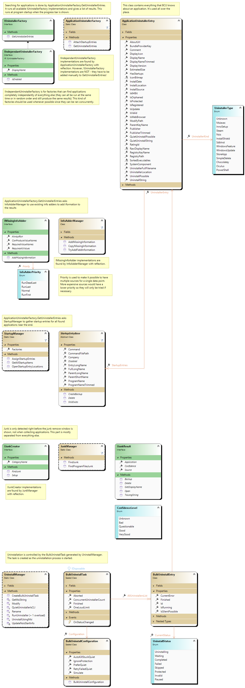

## How to file a bug report
Create a new issue with as much description of the problem as possible. Include steps needed for reproduction if the bug is not obvious.
It's also possible to submit bug reports anonymously to my [feedback form](http://klocmansoftware.weebly.com/feedback--contact.html).

## How to suggest a new feature
The same as bug report. Well-explained suggestions are preferred.

## How to donate
Check [README.md](README.md) or main window of BCUninstaller for the donate link. Only donate using the official donate links.

## How to help translate
Translations are stored in .resx files (almost all except for Resources.resx). It's suggested to use the [ResxTranslator](https://github.com/HakanL/resxtranslator) to translate these files. It will save you a lot of work. Most if not all of translators here use it.

### How-to list
1. Download latest version of the translation tool (ResxTranslator) from https://github.com/HakanL/resxtranslator
2. - If you are familiar with how git and GitHub works, you can create a branch, translate it, and then start a pull request.
   - Otherwise download the latest translation pack from the [releases](https://github.com/Klocman/Bulk-Crap-Uninstaller/releases).
3. Run the ResxTranslator and click "File > Open directory". Point it to the extracted translation pack or clone of your branch.
4. Click on any of the items in the left tree, it will open on the right. You will need to translate all of those items, most are quite small.
5. Put the translation into the column marked with your language's code. For example, if you are translating to German use the "de" column.
5. - For a list of all language codes click "Languages > Add > More Languages". If possible, use only neutral languages.
   - If possible, use a more general locale. For example try using "en" or "ru" instead of "en-GB" or "ru-RU".
   - If the column doesn't exist, click "Languages > Add > Your Code". If your code is not available, click "More Languages". 
   - You can hide columns for different languages using the checkboxes below the list.
6. Once in a while click "File > Save all modified" (or ctrl+s) to save your work in case something crashes.
7. Create a pull request or compress the folder you just modified to a .zip and send it back to me. If you don't have my e-mailaddress you can use the [feedback form](http://klocmansoftware.weebly.com/feedback--contact.html).

## How to contribute code
The best way is to push any changes you wish to make to your fork of this repository and then start a Pull Request.

Try to limit the contents of your PRs to a single bug fix or a single feature (it's best to create a new branch for each bugfix or feature). This makes it much easier to review and verify, and makes merging easier.

### How to set up your environment
Visual Studio 2019 or 2022 is recommended to edit and compile the source. You need the `.NET desktop development` and `Desktop development with C++` workloads. Optionally get the `Class Designer` component if you wish to view/edit the included class diagrams.

The source should compile from within VS without any extra work. If the compile fails the first time, try to Rebuild Solution.

Some of the tests require running as 64bit to pass, or some specific applications to be installed.

### Overview of the codebase
The codebase is split into the user interfaces (BCU-Console and BulkCrapUninstaller), libraries that do the actual work (UninstallTools), and small helper applications (SteamHelper, WinUpdateHelper).

The helpers adapt different kinds of applications into something that BCUninstaller can easily digest, and decouple highly specialized code from the main application. All of the helpers use CLI to talk with the UninstallTools library, and can be freely used by themselves in batch scripts and such.

Here's a simplified class diagram of UninstallTools, the place where most of the magic happens:

