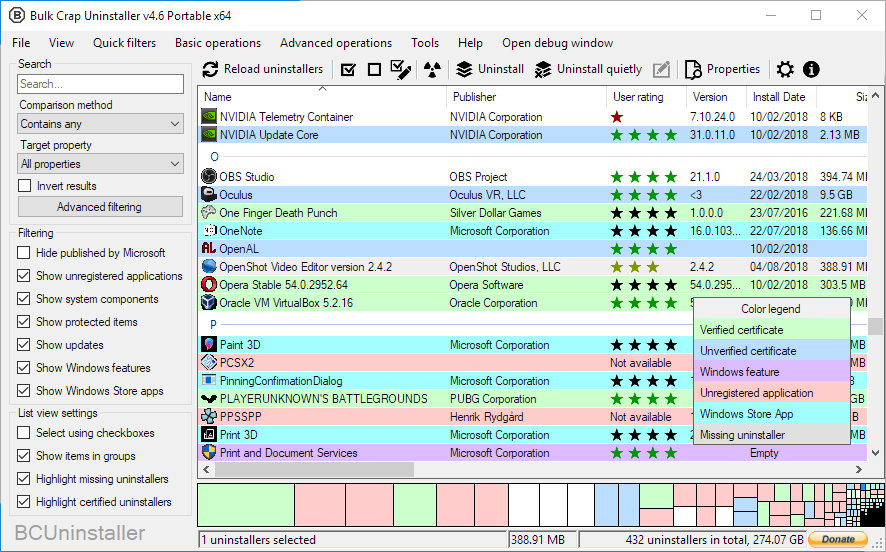
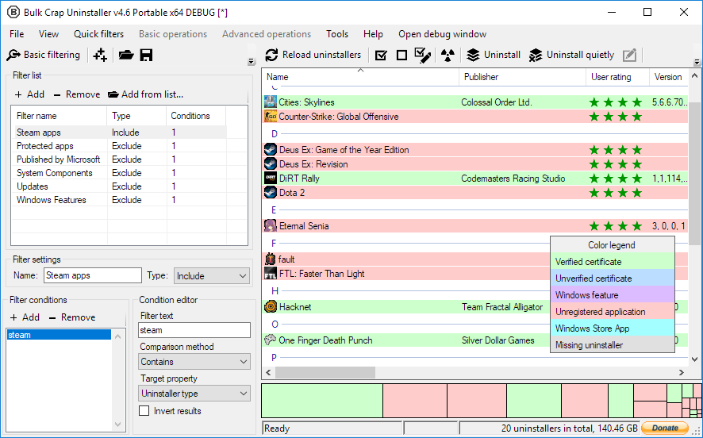
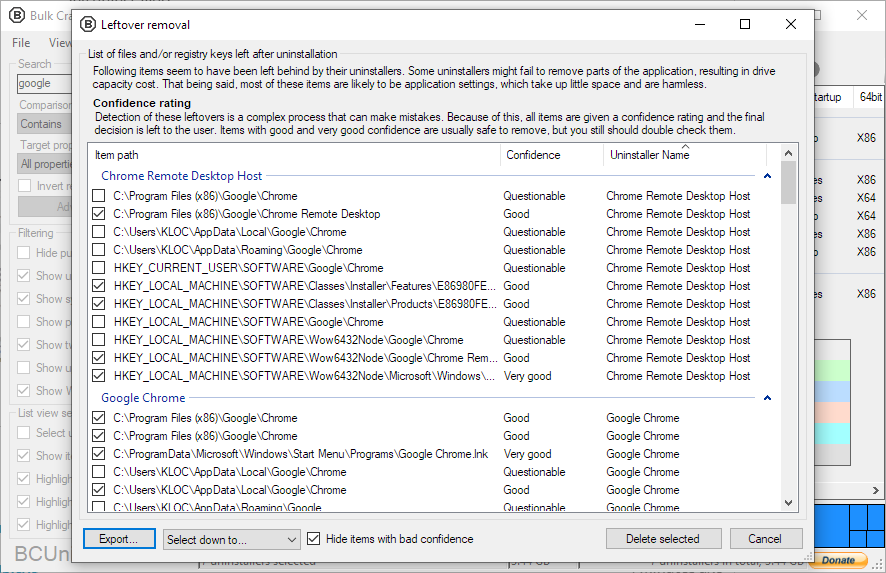

<iframe src="https://www.youtube-nocookie.com/embed/8v7r_jQl28Y?rel=0" 
frameborder="0" allow="encrypted-media" allowfullscreen class="video"></iframe>

# What is Bulk Crap Uninstaller? 
**Bulk Crap Uninstaller** (in short **BCUninstaller** or **BCU**) is a free (as in speech *and* beer) bulk program uninstaller with advanced automation. It excels at removing large amounts of applications with minimal to no user input, _while requiring next to no technical knowledge_.

It can detect most applications and games (even portable or not registered), clean up leftovers, force uninstall, automatically uninstall according to premade lists, and much more.

[You can read the manual here](https://htmlpreview.github.io/?https://github.com/Klocman/Bulk-Crap-Uninstaller/blob/master/doc/BCU_manual.html).

# Features
In its basic form BCU is easy to use by most users, but it also has tools useful for power users, system admins and developers. Some of the most notable features of Bulk Crap Uninstaller:

## Very thorough installed application detection
BCUninstaller can detect, manage and uninstall applications from the following sources:
* Normal registered applications (same as Programs and Features and many other uninstallers)
* Hidden/protected registered applications
* Applications with damaged or missing uninstallers
* Portable applications (looks in common locations and on portible drives, configurable)
* Chocolatey packages
* Oculus games/apps
* Steam games/apps
* Windows Features
* Windows Store apps (Universal Windows Platform apps)
* Windows Updates

Applications from all of these sources are treated the same - you can filter, export and automatically uninstall them in the same way.

## Fast, automatic uninstall
The main feature of BCUninstaller is its ability to fully or nearly fully automate the process of uninstalling multiple applications. BCU always attempts to use the application's original uninstaller to avoid issues found in uninstall managers that blindly remove files to achieve uninstall automation (e.g. failing to unregister context menu entries or services).
* Uninstall any number of applications in a single batch
* Minimal to no user input is required during uninstallation
* Uninstall multiple items at once to speed up the process (with collision prevention)
* Console interface can automatically uninstall applications based on conditions with no user input
* Quietly uninstall many uninstallers that don't support silent uninstallation
* Uninstall applications even if they don't have any uninstallers
* Uninstall applications by window, shortcut or directory
* Can handle crashing and hanging uninstallers

## Other features
While detection and uninstallation are the two main features of BCU that receive the most focus, it also has many useful tools built on top of that framework.
* Find and remove leftovers after uninstallation
* Clean Program Files directories from unused or empty folders
* Manually uninstall any application, bypasing it's uninstaller (Force uninstall)
* Startup manager
* Application ratings
* Huge amount of data about applications is collected and displayed. User can freely browse, filter and export everything
* Filtering with common presets or based on fully custom rules with Regex support
* Verification of uninstaller certificates
* Large amount of configurability
* Can run user-specified commands before and after uninstalling
* Can run on .Net 4.0 or newer, or, if not available, on .Net 3.5 with reduced functionality (will work on Windows 7 or newer with no updates installed)
* Fully portable, settings are saved to a single file

BCU is translated to Arabic, Czech, Dutch, English, French, German, Hungarian, Italian, Polish, Portuguese (Brazil and Portugal), Russian, Slovenian and Spanish at the moment of writing this. More to come! If you want to help translate BCU to a new language or update and existing translation please start an [issue](https://github.com/Klocman/Bulk-Crap-Uninstaller/issues) or contact me through the [feedback form](https://klocmansoftware.weebly.com/contact.html).

# System requirements
The system requirements are fairly lax since BCU was designed to work on any PC it is thrown at. If it boots, the chances are BCU will manage to run on it.
* OS: Windows Vista or newer is recommended. BCU will also work on XP and 2003 with reduced functionality and possibly some bugs. Both 32bit and 64bit versions are supported.
* .NET: Recommended .NET 4.0 or newer, can run on only .NET 3.5 with reduced functionality.
* RAM: Around 300MB or more of free RAM.
* CPU: Doesn't really matter.
* Free space: 50MB or more.
* HDD: Anything will work, but slower drives can make scan times quite a bit longer.

# Licensing and commercial use
Bulk Crap Uninstaller is licensed under [Apache 2.0 open source license](https://github.com/Klocman/Bulk-Crap-Uninstaller/blob/master/Licence.txt), and can be used in both private and commercial settings for free and with no obligations, as long as no conditions of the license are broken.
